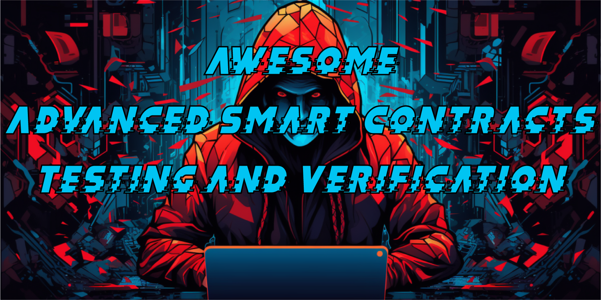

# Awesome Advanced Smart Contracts Testing and Verification 

> A curated collection of tools, frameworks, and resources for testing and verifying smart contracts. Meant to be used by blockchain developers and security researchers as a knowledge source.

## Contents

- [Tools](#tools)
- [Fuzzing](#fuzzing)
  - [Property-based Fuzz Testing](#invariants-fuzz-testing)
  - [Differential Fuzz Testing](#differential-fuzz-testing)
- [Formal Verification](#formal-verification)
- [Mutation Testing](#mutation-testing)
- [Branching Tree Technique](#branching-tree-technique)
- [Contribute](#contribute)

## Tools

Arsenal of fuzzing and verification tools, tailor-made for probing and dissecting the inner workings of smart contracts.

- [**Foundry | Ethereum development framework written in Rust**](https://github.com/foundry-rs)
- [**Echinda | Ethereum smart contract Property-based fuzzer**](https://github.com/crytic/echidna/)
- [**Medusa | Property-based fuzzer based on Echidna written in go**](https://github.com/crytic/medusa)
- [**Maat | Dynamic Symbolic Execution and Binary Analysis framework**](https://github.com/trailofbits/maat)
- [**Optik | Echidna + Maat coupling for coverage analysis driven Fuzzing**](https://github.com/crytic/optik/tree/master)
- [**Etheno | JSON RPC multiplexer, analysis tool wrapper, test integration tool**](https://github.com/crytic/etheno)
- [**Certora Prover | Formal verification Tool**](https://docs.certora.com/en/latest/docs/whitepaper/index.html#certora-tool-suite)
- [**Halmos | Symbolic testing tool for EVM smart contracts**](https://github.com/a16z/halmos)
- [**Simbolik | Solidity smart contract symbolic debugger**](https://simbolik.runtimeverification.com/)
- [**Kontrol | Formal verification with KEVM and Foundry**](https://docs.runtimeverification.com/kontrol/overview/readme)
- [**Dafny-EVM | functional specification of the Ethereum Virtual Machine in Dafny**](https://github.com/ConsenSys/evm-dafny)
- [**Pyrometer | symbolic execution, abstract interpretation, and static analysis**](https://github.com/nascentxyz/pyrometer/tree/master)
- [**Gambit | Solidity mutation system**](https://github.com/Certora/gambit)
- [**Vertigo-rs | Ethereum smart contract mutation testing framework**](https://github.com/JoranHonig/vertigo)
- [**Bulloak | Solidity test generator based on the Branching Tree Technique**](https://github.com/alexfertel/bulloak)

## Fuzzing

**Fuzzing** or **fuzz** testing is an automated software testing technique that involves providing invalid, unexpected, or randomly generated data as inputs to a computer program.

- [**Fuzzing Labs @Pat_Ventuzelo ETHCC5 Fuzzing talk**](https://docs.google.com/presentation/d/1uCgiclLuoFDtIlYSenf4CbTItAtqz6_QH6XoZi8xI7Q/edit#slide=id.g1107f83abee_0_65)
- [**Trail of Bits Fuzzing Workshop**](https://www.youtube.com/playlist?list=PLciHOL_J7Iwqdja9UH4ZzE8dP1IxtsBXI) (10 hours Workshop)
- [**@vn_martinez\_ Mastering Fuzzing**](https://www.youtube.com/watch?v=83q14K-WNKM) ([seminar materials](https://github.com/Elpacos/mastering-fuzzing))
- [**@dacian Exploiting Precision Loss via Fuzz Testing**](https://dacian.me/exploiting-precision-loss-via-fuzz-testing)
- [**Foundry Book Fuzz Testing**](https://book.getfoundry.sh/forge/fuzz-testing)
- [**Frax finance frax-solidity Foundry tests**](https://github.com/FraxFinance/frax-solidity/blob/master/src/foundry/test/veFPISProxy.t.sol)
- [**@paco0x Kyber Network exploit reproduction with Fuzzing**](https://github.com/paco0x/kyber-exploit-example)

### Property-based Fuzz Testing

**Property-based** testing aims to identify and test **invariants**. Invariants are conditions expressions that should always hold true over the course of a fuzzing campaign. Invariants are about properties of the system as a whole, rather than specific reactions to specific inputs.

- [**Trail of Bits pre-defined invariants**](https://github.com/crytic/properties)
- [**Trail of Bits Echidna Tutorials**](https://secure-contracts.com/program-analysis/echidna/index.html)
- [**Gustavo Grieco - Spearbit: Echidna Workshop**](https://www.youtube.com/watch?v=kAfknRlvAt0)
- [**@agfviggiano Advanced Fuzzing Techniques: An eBTC Case Study**](https://youtu.be/ELY_zjIAKuE?feature=shared)
- [**@agfviggiano OpenSense Invariant Testing Workshop**](https://www.youtube.com/watch?v=YAF79t_Sfiw)
- [**RareSkills invariant testing in foundry**](https://www.rareskills.io/post/invariant-testing-solidity)
- [**@horsefacts Invariant Testing WETH With Foundry**](https://mirror.xyz/horsefacts.eth/Jex2YVaO65dda6zEyfM_-DXlXhOWCAoSpOx5PLocYgwç)
- [**Patrick Collins Fuzz | Invariant Tests**](https://patrickalphac.medium.com/fuzz-invariant-tests-the-new-bare-minimum-for-smart-contract-security-87ebe150e88c)
- [**Hybrid fuzzing: Sharpening the spikes of Echidna**](https://blog.trailofbits.com/2022/12/08/hybrid-echidna-fuzzing-optik-maat/)
- [**Foundry Book Invariant Testing**](https://book.getfoundry.sh/forge/invariant-testing)
- [**BadgerDAO eBTC invariant fuzzing setup**](https://github.com/code-423n4/2023-10-badger/tree/main/packages/contracts/foundry_test)
- [**Maple core v2 tests**](https://github.com/maple-labs/maple-core-v2/tree/main/tests)
- [**Uniswap permit 2 AllowanceTransferInvariants.t.sol**](https://github.com/Uniswap/permit2/blob/main/test/AllowanceTransferInvariants.t.sol)
- [**Frax finance frax-solidity Echidna tests**](https://github.com/FraxFinance/frax-solidity/tree/master/src/echidna)
- [**Sablier-labs v2-core foundry invariants**](https://github.com/sablier-labs/v2-core/tree/main/test/invariant)

### Differential Fuzz Testing

**Differential testing** is used to ensure identical behavior between two or more implementations of equivalent code. Useful if you are upgrading/updating code, or have written a more optimized version but you want to verify congruence among implementations.

- [**@annascarrol Solidity Summit 2023 - Differential Testing with Foundry by Anna Carroll**](https://twitter.com/i/broadcasts/1BdGYrpOQVXJX) ([link 2](https://www.youtube.com/watch?v=wV8xuj-XsjA&list=PLX8x7Zj6VeznJuVkZtRyKwseJdrr4mNsE&index=13))
- [**Differential Test | Testing with Foundry**](https://www.youtube.com/watch?v=WhZQhxOG124)
- [**Foundry Book differential testing**](https://book.getfoundry.sh/forge/differential-ffi-testing)
- [**Seaport | Discussion #809 Understanding the "DifferentialTest" test contract**](https://github.com/ProjectOpenSea/seaport/discussions/809)
- [**Murky Merkle Tree DifferentialTests.t.sol**](https://github.com/dmfxyz/murky/blob/main/differential_testing/test/DifferentialTests.t.sol)
- [**EnbangWu Differential Fuzzing of solidity Fixed-point libraries**](https://github.com/EnbangWu/differential-fuzzing)
- [**Using Halmos to Formally Verify Solady's FixedPointMathLib**](https://github.com/zobront/halmos-solady)

## Formal Verification

**Formal Verification** is an approach to assessing the correctness of software by checking whether a formal model of the program matches the formal specification. Unlike testing, formal verification can verify a smart contract's execution satisfies a formal specification for all executions without needing to execute it with sample data.

- [**Certora prover documentation**](https://docs.certora.com/en/latest/)
- [**Certora ERC4626 TrustX 2023 workshop**](https://github.com/Certora/ERC4626_Workshop)
- [**Certora Formal Verification of Openzeppelin contracts**](https://github.com/OpenZeppelin/openzeppelin-contracts/blob/master/certora/README.md)
- [**Everything You Wanted to Know About Symbolic Execution for Ethereum Smart Contracts**](https://hackmd.io/@SaferMaker/EVM-Sym-Exec)
- [**The Easy Way To Quit (Concrete) Testing**](https://hackmd.io/@SaferMaker/EVM-Sym-Test)
- [**0xkarmacoma Beyond Fuzzing: Symbolic Testing in Practice Solidity Summit 2023**](https://www.youtube.com/watch?v=GFCjG5KOetM&list=PLX8x7Zj6VeznJuVkZtRyKwseJdrr4mNsE&index=13) ([X thread](https://twitter.com/0xkarmacoma/status/1725675343993065504))
- [**runtime verification The Symbolic Solidity Debugger TrustX 2023**](https://app.streameth.org/secureum/secureum_trustx/session/the_symbolic_solidity_debugger)
- [**jellopaper.org KEVM: Semantics of EVM in K**](https://jellopaper.org/)
- [**David Pearce Formal Verification of EVM Bytecode with DafnyEVM Solidity Summit 2023**](https://app.streameth.org/devconnect/evm_summit/session/formal_verification_of_evm_bytecode)

## Mutation Testing

Mutation testing is a technique for evaluating and improving test suites. The key idea is to introduce faults, called mutants, to the program under test and measure a test suite’s ability to detect these mutants.

- [**Chandrakana Nandi, How Good Is Your Formal Specification? Mutation Testing To The Rescue! Solidity Summit 2023**](https://www.youtube.com/watch?v=g3dxF7XfBWk&list=PLX8x7Zj6VeznJuVkZtRyKwseJdrr4mNsE&index=5)
- [**Certora Gambit: Mutation Generator for Solidity Docs**](http://rtora.com/en/latest/docs/gambit/index.html)

## Branching Tree Technique

Specification framework for writing structured Solidity tests.

- [**@PaulRBerg Branching Tree Technique**](https://twitter.com/PaulRBerg/status/1682346315806539776)
- [**@PaulRberg Solidity Summit 2023 Branching Tree Technique**](https://www.youtube.com/watch?v=0-EmbNVgFA4&list=PLX8x7Zj6VeznJuVkZtRyKwseJdrr4mNsE&index=14)
- [**PaulRBerg/btt-examples**](https://github.com/PaulRBerg/btt-examples)

## Contribute

Contributions welcome! Read the [contribution guidelines](contributing.md) first.
